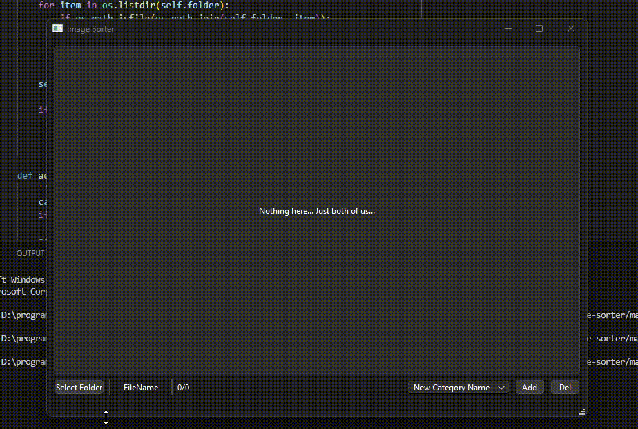

# Simple Python Image sorting tool

This is a simple Python app that allows you to sort images by categories and move them to corresponding folders. The app uses the `PyQt6` module for its GUI and python 3.10.0 or higher.

### How to install
- Clone this repository 
- Install dependencies by running `pip install -r requirements.txt`
- Run the main file by running `python main.py`

### Demo

### How to use
- Press "Select Folder" button and select the folder that contains the images you want to sort
- Type in the new category name if needed in the droplist and press "Add" button. You can add as many categories as you like.
- To delete a category, select it from the droplist and press "Del" button. Keep in mind that all the images from that category will be moved to main folder
- To move the image to the desired category, press button with the name of the category.

If you want to open the image in default image viewer, you can click on the text containing the image name.
After moving all the images, app will reset to initial state.